# meu-checklist-tarefas-mvp

2ª Entrega trabalho PUC-Rio, CCE Extensão - Engenharia de Software (Michelle Rodrigues - Matricula 10914039709)

Para entender o Contexto/Executar a aplicação pela primeira vez (sprint anterior):
Leia: README_1aEntrega.md

Esta solução PerSpecML => 
US1 - COMO usuária do site meu-checklist-tarefas QUERO realizar a classificação automática de uma tarefa PARA saber em qual categoria ela se encaixa melhor.
Melhorias efetuadas:

[DISCIPLINA SOFTWARE INTELIGENTES]

1 - PerSpecML => 
US1 - COMO usuária do site meu-checklist-tarefas QUERO realizar a classificação automática de uma tarefa PARA saber em qual categoria ela se encaixa melhor.
1.1 - Requisitos de Negócio
   Objetivo: Classificar tarefas domésticas em categorias pré-definidas com acurácia ≥ 85%.
   Critérios de Sucesso: Acurácia ≥ 85% ; F1-score ≥ 80% ; 

1.2 - Entendimento dos Dados
Fontes: 
    Dados históricos de tarefas categorizadas manualmente (+10k)
Pré-processamento: 
    Limpeza de texto (remoção de stopwords, lowercase ); Tokenização e vetorização (TF-IDF )

1.3 - Modelagem
Algoritmos:
    Baseline: Naive Bayes (fazer comparativo entre os algoritmos mais utilizados)
Treinamento:
    Validação cruzada (5 folds) e ajuste de pesos

1.4 - Avaliação:
Unitários: Verificação de pré-processamento e métricas.
Sistema: API REST com endpoint /GET/api/categorias/ml/{nome_tarefa}

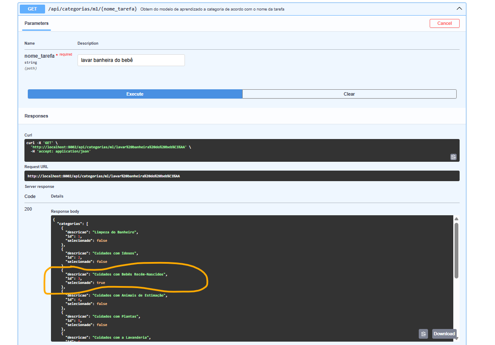


***[FUNCIONALIDADES ENTREGUES]***


2 - Disponibilização de Cadastro de Tarefa para o usuário, com inteligência artifical no backend,


3 - Implementação de Software integigente com análise preditiva para a classificação de Tarefas em suas categorias.
32.1 - Execute o Notebook em: 
https://colab.research.google.com/drive/1gA8DLnlkgyxXSB6EuBQrHeFNfOAEcLCw?usp=sharing


3.2 - Prints da execução do Colabs (a 1a vez demorou 14min)

"""1 - Configurações iniciais e Imports"""

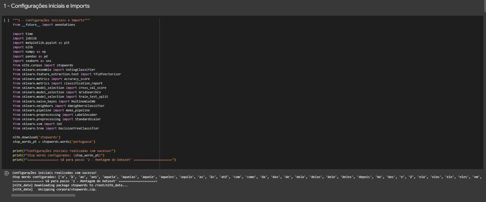

"""2 - Montagem do Dataset"""
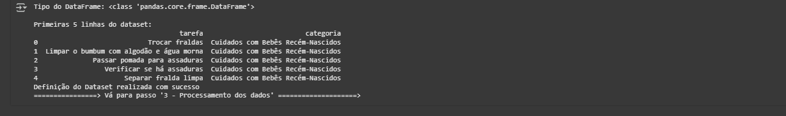

"""3 - Pré-Processamento dos dados"""
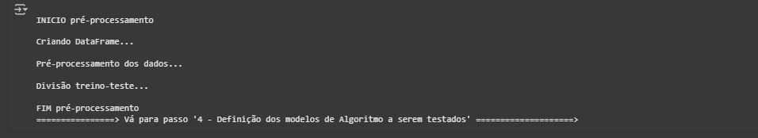

""" 4 - Definição dos modelos de Algoritmo a serem testados """
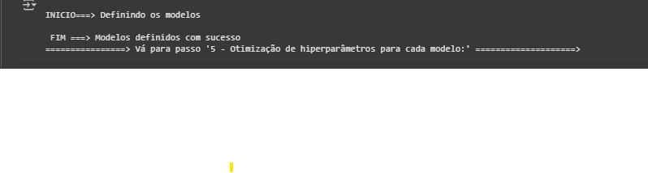

"""5 - Otimização de hiperparâmetros para cada modelo """


""" 6 - Treinamento e avaliação dos modelos """

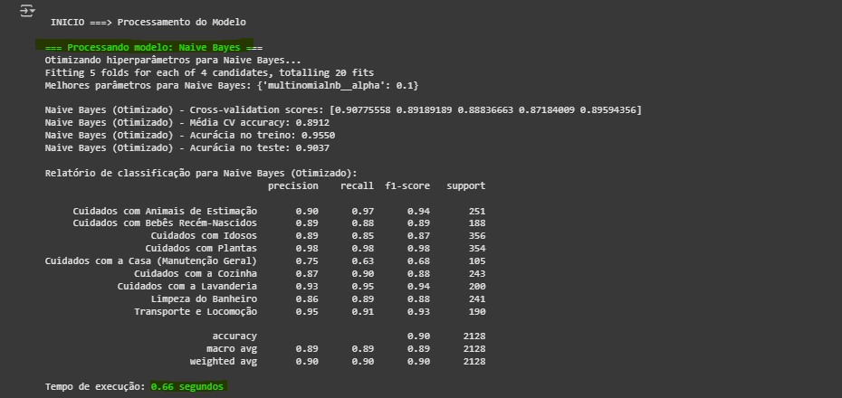


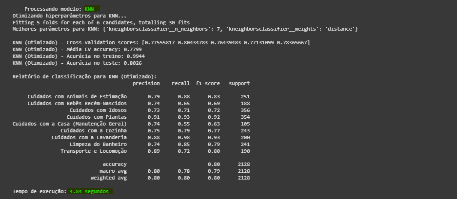


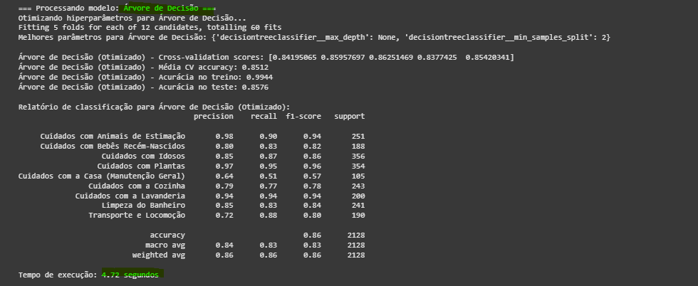


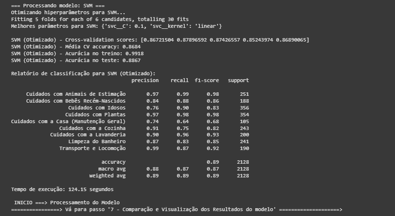


"""7 - Comparação e Visualização dos Resultados do modelo """

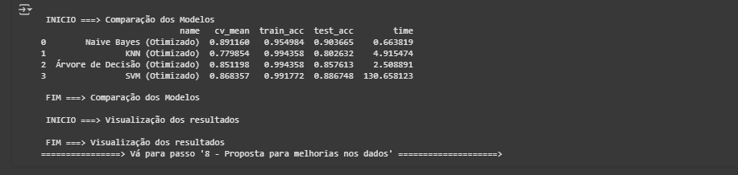


"""8 - Ensemble com os melhores modelos"""

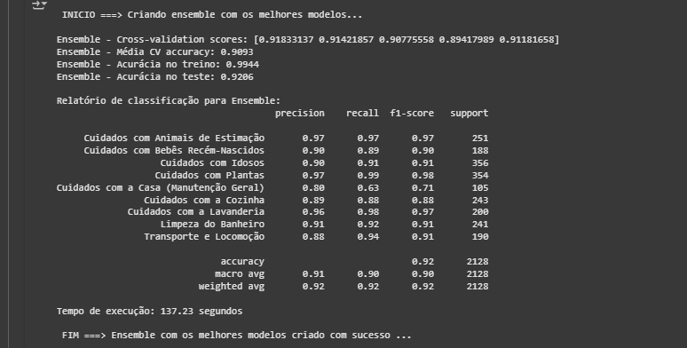

Gráfico
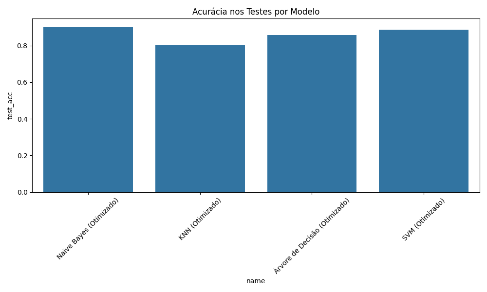


"""9 - Predição de Categoria Utilizando o Ensenble"""

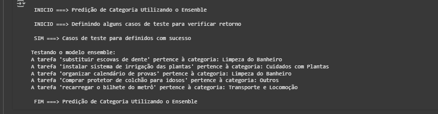

"""10 - Escolha dos melhores modelos"""

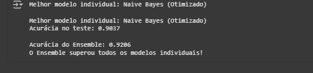


4 - Integração Front x Backend na rota de cadastro de tarefas. Onde o usuário digita a tarefa e o backend prevê a categoria. Caso a categoria não seja satisfatória( Outros), o usuário pode selecionar outra antes de cadastrar a tarefa.

4.1 - Cadastrando uma nova Tarefa (Categoria informada automaticamente)
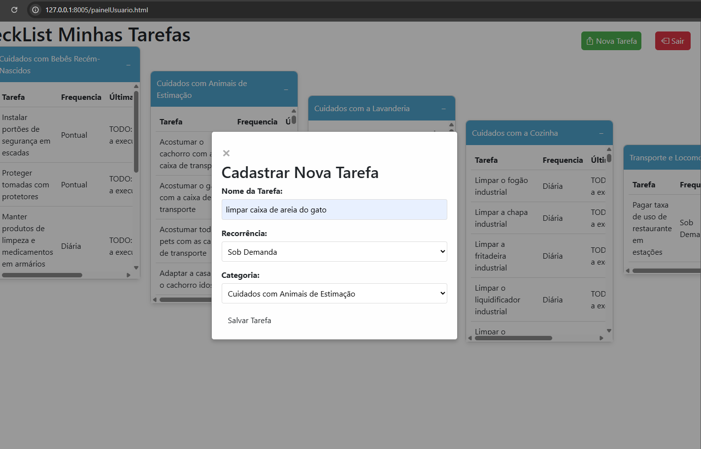

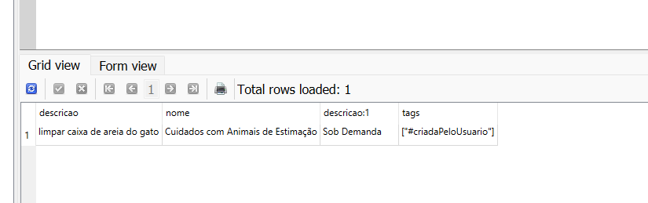 

4.2 - Nova Tarefa cadastrada na base de dados
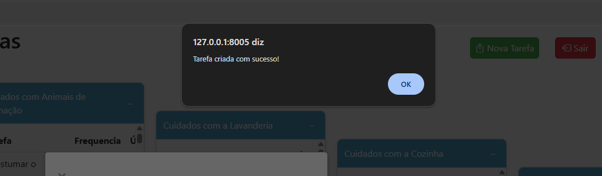 

4.3 - Tag do Usuário
[DÉBITO TÉCNICO]: Atualmente, dada a modelagem inicial das tags do usuário estarem atreladas ao questionário, 
as novas tarefas cadastradas pelo usuário ainda não aparecerão no Painel do usuário (em sua devida categoria)
Isto porque, para isso acontecer, é necessário detectar o usuário logado e modelar uma nova funcionalidade 
para guardar as hashtags de tarefas cadastradas pelo usuário.
(na v0, o usuário responde questionário e o questionário endereça as hashtags, que listam as tarefas do painel do usuário)

Como cumprimento do requisito do MVP2, a integração foi feita corretamente, fazendo com que o front enviasse uma requisição ao backend, 
o Backend passasse pela aanálise preditiva e devolvesse o valor da Categoria.


5 - Incorporação e melhoria da base de dados, agora com +10K de tarefas cadastradas
5.1 - Utilização de MLA ([manus](https://manus.im/app)) para gerar tarefas para o dataset

6 - Disponibilização do dataset exemplo utilizado na solução. 
<<LInk do Git>>

[DISCIPLINA QUALIDADE DE SOFTWARE]
7 - Implementação de testes de Automatizados para verificação de acurária e probabilidade
Para executar: 

    ```bash
    git clone https://github.com/michellerodrigues/meu-checklist-tarefas-api.git
    cd meu-checklist-tarefas-api
    pytest  meu_checklit_trarefas_testes_automatizados.py -v
    ```
67.1 - Exemplo execução
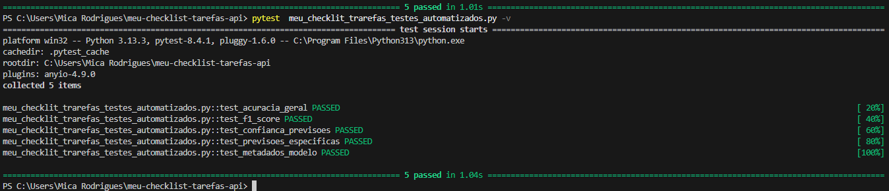


[DISCIPLINA QUALIDADE DE SOFTWARE]
8 - Implementação de Linters para Análise Estática de código com os seguintes plugins:
# Linters e Formatters
black==23.7.0
flake8==6.0.0
isort==5.12.0
mypy==1.4.1
pylint==2.17.4
bandit==1.7.5
pydocstyle==6.3.0

8.1 - Configuração de '.pre-commit-config.yaml' para executar automaticamente a cada login do git. De forma que se não estiver em conformidade, o commit não será efetuado

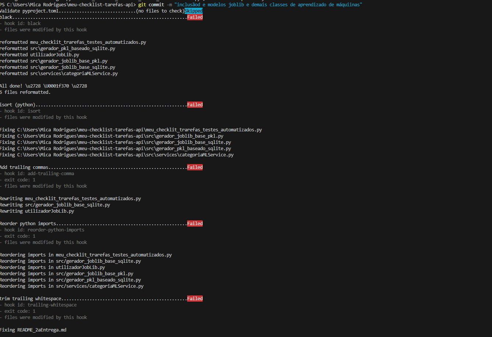

8.2 - [DEBITO TÉCNICO] Fica previsto para a próxima entrega a melhoria dos avisos dos linters. Muitos foram corrigidos, entretanto, para manter o foco na entrega, o commit do git deverá ser executado com o --no-verify (não aconselhável para produção, claro)
   
    ```bash
    git commit -m "inclusãod e modelos joblib e demais classes de aprendizado de máquiinas" --no-verify
    ```

8.3 - [DEBITO TÉCNICO] 
Fica previsto para a próxima entrega também a configuração do teste automatizado no hook do pre-commit com o git. Infelizmente não deu tempo de implementar. Data a complexidade da montagem do ML.

[SEGURANÇA DA INFORMAÇÃO]
9 - Como reflexão dos itens de segurança da informação (Software Seguro), a aplicação possui uma segurança mínima com login e senha do usuário criptografada na base de dados.
Em observação a LGPD, nenhum dado do usuário é exposto pois as tarefas não possuem informações de documentos, dados pessoais, etc.
9.1 - [DÉBITO TÉCNICO] Implementar Token do usuário para detectar o usuário logado, juntar com as hashtags do usuário e carregar o painel fazendo a composição das hahstags do questionário e as do usuário (cadastradas através das tarefas)


10 - CÓDIGOS AUXILIARES
Este repositório conta com alguns códigos auxiliares:

10.1 - gerador_pkl_baseado_sqlite.py - Neste arquivo são gerados os 2 arquivos de dataset (pkl e csv), baseado na base dados (CSV utilizado particularmente no Colab) [dataset_tarefas.csv e dataset_tarefas.pkl]
    
    ```bash
    git clone https://github.com/michellerodrigues/meu-checklist-tarefas-api.git
    cd meu-checklist-tarefas-api
    python gerador_pkl_baseado_sqlite.py
    ```

10.2 - Notebook Classificação - Meu Cheklist Tarefas.ipynb [Notebook Colab] (execução descrita no item 2)

10.3 - gerador_joblib_base_sqlite.py  - Executar esse arquivo para gerar os joblibs (baseado no banco de dados sqlite)

    ```bash
    git clone https://github.com/michellerodrigues/meu-checklist-tarefas-api.git
    cd meu-checklist-tarefas-api
    python src/gerador_joblib_base_sqlite.py 
    ```

10.4 - Joblibs gerados
modelo_completo.joblib - Considera o Melhor modelo revelado no Colab + Ensenble com as melhores probabilidades de todos os algoritmos treinados
modelo_árvore_de_decisão.joblib - Considera o algoritmo árvore de decisão (treino e teste)
modelo_knn.joblib - Considera o algoritmo KNN (treino e teste)
modelo_naive_bayes.joblib - Considera o algoritmo NB (treino e teste) ==> ALGORITMO ESCOLHIDO
modelo_scm.joblib - Considera o algoritmo SVM (treino e teste)

10.5 - utilizadorJobLib.py - Através desse arquivo é posspivel fazer uso do joblib do modelo treinado para prever a categoria. Atualmente estou utilizando o 'modelo_completo.joblib'
    
    ```bash
    git clone https://github.com/michellerodrigues/meu-checklist-tarefas-api.git
    cd meu-checklist-tarefas-api
    python utilizadorJoblib.py
    ```

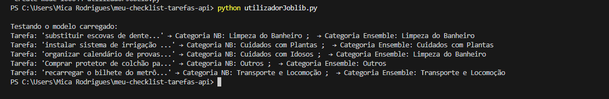

10.5 - meu_checklit_trarefas_testes_automatizados.py [Testes automatizados] (execução descrita no item 6)

10.6 - Nova estrutura do projeto atualizada

./
├── .gitignore
├── .pre-commit-config.yaml
├── .pylintrc
├── dataset_tarefas.csv
├── dataset_tarefas.pkl
├── dependencias.txt
├── estrutura.txt
├── meu_checklit_trarefas_testes_automatizados.py
├── modelo_completo.joblib
├── modelo_knn.joblib
├── modelo_naive_bayes.joblib
├── modelo_svm.joblib
├── modelo_árvore_de_decisão.joblib
├── Notebook Classificação - Meu Cheklist Tarefas.ipynb
├── README.md
├── README_2aEntrega.md
├── requirements.txt
├── utilizadorJobLib.py
├── database/
│   ├── banco_tarefas.sqlite3
├── leia-me/
│   ├── Documentacao-Entrega.md
│   ├── estrutura-api.txt
│   ├── estrutura.txt
│   ├── gerar_estrutura_projeto.py
│   ├── MeuCheckLisTarefas-Apresentação.pptx
│   ├── readme.md
│   ├── imagens/
│   │   ├── Captura de tela 2025-07-05 162947.png
│   │   ├── Captura de tela 2025-07-05 163002.png
│   │   ├── Captura de tela 2025-07-05 163040.png
│   │   ├── Captura de tela 2025-07-05 163154.png
│   │   ├── comparacao_modelos.png
│   │   ├── image-1.png
│   │   ├── image-10.png
│   │   ├── image-11.png
│   │   ├── image-12.png
│   │   ├── image-13.png
│   │   ├── image-14.png
│   │   ├── image-15.png
│   │   ├── image-16.png
│   │   ├── image-17.png
│   │   ├── image-18.png
│   │   ├── image-2.png
│   │   ├── image-3.png
│   │   ├── image-4.png
│   │   ├── image-5.png
│   │   ├── image-6.png
│   │   ├── image-7.png
│   │   ├── image-8.png
│   │   ├── image-9.png
│   │   ├── image.png
├── src/
│   ├── config.env
│   ├── gerador_joblib_base_pkl.py
│   ├── gerador_joblib_base_sqlite.py
│   ├── gerador_pkl_baseado_sqlite.py
│   ├── main.py
│   ├── pyproject.toml
│   ├── __init__.py
│   ├── database/
│   │   ├── banco_tarefas.sqlite3
│   │   ├── database.py
│   ├── hooks/
│   ├── meu_checklist_tarefas.egg-info/
│   │   ├── dependency_links.txt
│   │   ├── PKG-INFO
│   │   ├── SOURCES.txt
│   │   ├── top_level.txt
│   ├── models/
│   │   ├── base.py
│   │   ├── categoria.py
│   │   ├── questionario.py
│   │   ├── usuario.py
│   │   ├── __init__.py
│   ├── routers/
│   │   ├── autenticacao.py
│   │   ├── categorias.py
│   │   ├── questionario.py
│   │   ├── recorrencias.py
│   │   ├── tarefas.py
│   │   ├── __init__.py
│   ├── schemas/
│   │   ├── base.py
│   │   ├── categoria.py
│   │   ├── conjunto_treinamento.py
│   │   ├── converters.py
│   │   ├── datasetTarefas.py
│   │   ├── questionario.py
│   │   ├── usuario.py
│   │   ├── __init__.py
│   ├── security/
│   │   ├── security.py
│   │   ├── __init__.py
│   ├── services/
│   │   ├── autenticacao.py
│   │   ├── categoriaMLService.py
│   │   ├── categorias.py
│   │   ├── questionario.py
│   │   ├── tarefas.py
│   │   ├── __init__.py


OBRIGADA POR LER ATÉ AQUI!!!! :)
